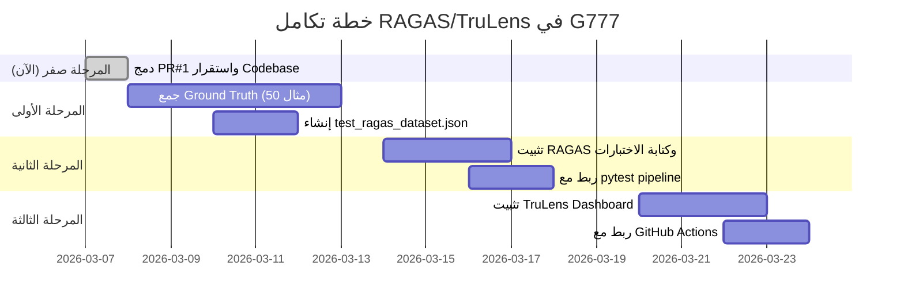
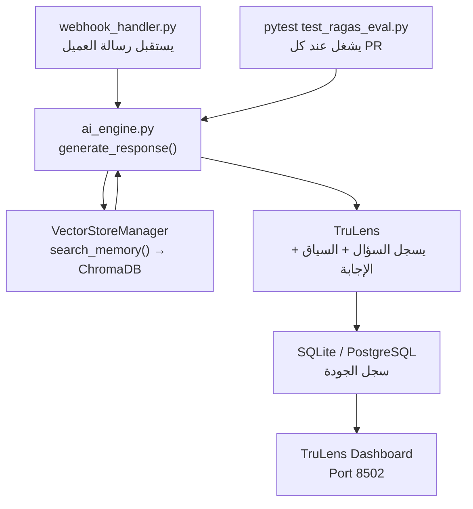

# خطة تكامل RAGAS / TruLens — مشروع G777 Antigravity

**الإصدار:** 1.0
**تاريخ الإعداد:** 2026-03-07
**المُعِد:** CNS Squad (Researcher + Orchestrator)
**الحالة:** مسودة معتمدة للتنفيذ في المرحلة القادمة

---

## 1. لماذا نحتاج RAGAS/TruLens؟

> [!IMPORTANT]
> مشروع G777 يُشغّل نظام RAG **حقيقي وفعّال** حالياً:
> - **Retriever:** `VectorStoreManager` → ChromaDB (`data/chroma_db/`)
> - **Generator:** `AIEngine.generate_response()` → Gemini 2.0 Flash
> - **Orchestrator:** `backend/agents/orchestrator.py` → يبحث في الذاكرة ويولّد الرد
>
> بدون قياس، لا نعرف إذا كانت إجابات الـ AI تُجيب فعلاً على السؤال أم تهذي.

### المشكلة التي تحلها هذه الخطة:

| المشكلة | الأثر | الحل |
|---|---|---|
| ردود غير ذات صلة | عملاء ساخطون | قياس Answer Relevancy |
| استرجاع خاطئ من ChromaDB | معلومات كاذبة | قياس Context Recall |
| توليد خارج السياق | خسارة ثقة العميل | قياس Faithfulness |
| تدهور الجودة بمرور الوقت | لا أحد يلاحظ | TruLens Dashboard |

---

## 2. خريطة المراحل



---

## 3. المرحلة الأولى: جمع Ground Truth

### ما هو Ground Truth؟
مجموعة من **50 سؤالاً حقيقياً** يرسلها العملاء للبوت مع **الإجابة المثالية المتوقعة** التي يكتبها خبير بشري.

### هيكل ملف البيانات (`tests/ragas_dataset.json`):

```json
{
  "samples": [
    {
      "id": "Q001",
      "question": "كم سعر رحلة شرم الشيخ لشخص واحد؟",
      "ground_truth": "سعر رحلة شرم الشيخ لشخص واحد يبدأ من 4500 جنيه مصري شاملاً الإقامة والمواصلات.",
      "context_category": "trips_pricing",
      "language": "ar"
    },
    {
      "id": "Q002",
      "question": "هل في رحلات الغردقة في اكتوبر؟",
      "ground_truth": "نعم، لدينا رحلات إلى الغردقة طوال شهر أكتوبر. يمكنني إرسال تفاصيل المواعيد والأسعار.",
      "context_category": "trips_availability",
      "language": "ar"
    }
  ]
}
```

---

## 4. المرحلة الثانية: تكامل RAGAS

### 4.1 المكتبات المطلوبة (تُضاف لـ `requirements.txt`):

```txt
# AI Evaluation
ragas>=0.1.10
datasets>=2.14.0
langchain-google-genai>=1.0.0
```

### 4.2 ملف الاختبار (`tests/test_ragas_eval.py`):

```python
"""
RAGAS Evaluation Suite for G777 AI Engine (RAG Pipeline).
Measures: Faithfulness, Answer Relevancy, Context Recall, Context Precision.
"""

import json
import pytest
import asyncio
import logging
from pathlib import Path
from typing import List, Dict, Any
from datasets import Dataset
from ragas import evaluate
from ragas.metrics import (
    faithfulness,
    answer_relevancy,
    context_recall,
    context_precision,
)
from backend.ai_engine import AIEngine
from backend.memory.vector_store_manager import VectorStoreManager

logger = logging.getLogger(__name__)

DATASET_PATH = Path("tests/ragas_dataset.json")
MIN_FAITHFULNESS = 0.75
MIN_RELEVANCY = 0.70


def load_ground_truth() -> List[Dict[str, Any]]:
    """Load the manually curated ground truth dataset."""
    with open(DATASET_PATH, "r", encoding="utf-8") as f:
        return json.load(f)["samples"]


@pytest.mark.asyncio
async def test_ai_engine_faithfulness():
    """
    Verifies that AI responses are grounded in the retrieved context.
    A score below MIN_FAITHFULNESS means the AI is hallucinating.
    """
    engine = AIEngine()
    vector_store = VectorStoreManager()
    samples = load_ground_truth()

    questions, answers, contexts, ground_truths = [], [], [], []

    for sample in samples:
        question = sample["question"]
        gt = sample["ground_truth"]

        # Retrieve context from ChromaDB (same as production flow)
        retrieved = vector_store.search_memory(
            collection_name="knowledge_base",
            query=question,
            n_results=3,
        )
        context_texts = [r["document"] for r in retrieved] if retrieved else [""]

        # Generate AI response
        response = await engine.generate_response(
            message=question,
            customer={},
            tenant_settings={},
        )

        questions.append(question)
        answers.append(response.get("text", ""))
        contexts.append(context_texts)
        ground_truths.append(gt)

    # Build RAGAS dataset
    ragas_dataset = Dataset.from_dict({
        "question": questions,
        "answer": answers,
        "contexts": contexts,
        "ground_truth": ground_truths,
    })

    result = evaluate(
        ragas_dataset,
        metrics=[faithfulness, answer_relevancy, context_recall, context_precision],
    )

    logger.info("RAGAS Evaluation Results: %s", result)

    assert result["faithfulness"] >= MIN_FAITHFULNESS, (
        f"Faithfulness too low: {result['faithfulness']:.2f} < {MIN_FAITHFULNESS}. "
        "AI is hallucinating — review ChromaDB knowledge base."
    )
    assert result["answer_relevancy"] >= MIN_RELEVANCY, (
        f"Answer Relevancy too low: {result['answer_relevancy']:.2f} < {MIN_RELEVANCY}. "
        "AI answers are off-topic."
    )
```

### 4.3 أوامر التشغيل:

```bash
# تشغيل مع تقرير HTML
pytest tests/test_ragas_eval.py -v --html=Artifacts/ragas_report.html

# تشغيل سريع فقط لـ Faithfulness
pytest tests/test_ragas_eval.py::test_ai_engine_faithfulness -v
```

---

## 5. المرحلة الثالثة: TruLens Dashboard

### 5.1 المكتبات المطلوبة:

```txt
# TruLens Evaluation Dashboard
trulens-eval>=0.28.0
```

### 5.2 ملف التهيئة (`backend/eval/trulens_setup.py`):

```python
"""
TruLens integration for continuous AI quality monitoring.
Wraps the G777 AIEngine to track response quality over time.
"""

import logging
from trulens.apps.custom import TruCustomApp, instrument
from trulens.core import TruSession
from backend.ai_engine import AIEngine

logger = logging.getLogger(__name__)


class InstrumentedAIEngine(AIEngine):
    """
    Extends AIEngine with TruLens instrumentation.
    All calls to generate_response() will be automatically tracked.
    """

    @instrument
    async def generate_response(self, message: str, customer: dict, tenant_settings: dict):
        """Instrumented wrapper — TruLens records this call."""
        return await super().generate_response(message, customer, tenant_settings)


def get_trulens_app() -> TruCustomApp:
    """Factory function that returns an instrumented version of AIEngine."""
    session = TruSession()
    engine = InstrumentedAIEngine()
    tru_app = TruCustomApp(engine, app_name="G777-Yasmine", app_version="2.2.0")
    logger.info("TruLens instrumentation active for G777 AIEngine")
    return tru_app


def launch_dashboard(port: int = 8502):
    """Launch the TruLens monitoring dashboard (separate from main app)."""
    from trulens.dashboard import run_dashboard
    run_dashboard(port=port)
```

### 5.3 تشغيل الـ Dashboard:

```bash
# يفتح لوحة تحكم مستقلة على المنفذ 8502
python -c "from backend.eval.trulens_setup import launch_dashboard; launch_dashboard()"
```

---

## 6. نقاط التكامل مع Codebase الحالي



---

## 7. مؤشرات الجودة المستهدفة (KPIs)

| المقياس | المعنى | الحد الأدنى المقبول |
|---|---|---|
| **Faithfulness** | هل الرد مبني على السياق المسترجع؟ | ≥ 0.75 |
| **Answer Relevancy** | هل الرد يجيب على السؤال فعلاً؟ | ≥ 0.70 |
| **Context Recall** | هل تم استرجاع المعلومات الصحيحة من ChromaDB؟ | ≥ 0.65 |
| **Context Precision** | هل السياق المسترجع دقيق وليس عاماً؟ | ≥ 0.60 |

> [!WARNING]
> إذا انخفض أي مؤشر عن الحد الأدنى، يُشغَّل بروتوكول **Rollback** (القاعدة 10 من CNS Squad).

---

## 8. مهام التنفيذ (tasks.json — للتحديث لاحقاً)

```json
{
  "sprint": "RAGAS Integration",
  "tasks": [
    {
      "id": "T-R01",
      "file": "tests/ragas_dataset.json",
      "action": "CREATE",
      "description": "جمع 50 مثالاً حقيقياً من سجلات العملاء وكتابة الإجابات المثالية",
      "assigned_to": "Human Lead Engineer",
      "status": "pending"
    },
    {
      "id": "T-R02",
      "file": "requirements.txt",
      "action": "MODIFY",
      "description": "إضافة ragas>=0.1.10 و trulens-eval>=0.28.0",
      "assigned_to": "Coder",
      "status": "pending"
    },
    {
      "id": "T-R03",
      "file": "tests/test_ragas_eval.py",
      "action": "CREATE",
      "description": "كتابة اختبار RAGAS الكامل الموصوف في القسم 4.2",
      "assigned_to": "Coder",
      "status": "pending"
    },
    {
      "id": "T-R04",
      "file": "backend/eval/trulens_setup.py",
      "action": "CREATE",
      "description": "تهيئة TruLens instrumentation حول AIEngine",
      "assigned_to": "Coder",
      "status": "pending"
    },
    {
      "id": "T-R05",
      "file": ".github/workflows/ragas_eval.yml",
      "action": "CREATE",
      "description": "GitHub Action يشغل RAGAS تلقائياً عند كل PR",
      "assigned_to": "Sentinel",
      "status": "pending"
    },
    {
      "id": "T-R06",
      "file": ".agent/MEMORY.md",
      "action": "UPDATE",
      "description": "تحديث MEMORY.md بنتائج أول تشغيل لـ RAGAS",
      "assigned_to": "Researcher",
      "status": "pending"
    }
  ]
}
```

---

## 9. GitHub Action للتشغيل التلقائي (مخطط)

```yaml
# .github/workflows/ragas_eval.yml
name: RAGAS AI Quality Gate

on:
  pull_request:
    branches: [main]
    paths:
      - 'backend/ai_engine.py'
      - 'backend/memory/**'
      - 'config/ai_instructions.yaml'

jobs:
  ragas-eval:
    runs-on: ubuntu-latest
    steps:
      - uses: actions/checkout@v4
      - name: Setup Python
        uses: actions/setup-python@v5
        with:
          python-version: '3.11'
      - name: Install dependencies
        run: pip install -r requirements.txt
      - name: Run RAGAS Evaluation
        env:
          GEMINI_API_KEY: ${{ secrets.GEMINI_API_KEY }}
        run: pytest tests/test_ragas_eval.py -v --tb=short
```

---

## 10. ملاحظات الامتثال (CNS Squad Compliance)

> [!NOTE]
> - **Zero-Regression:** اختبارات RAGAS تُشغَّل في بيئة معزولة — لا تمس قاعدة البيانات الإنتاجية.
> - **Config-First:** `GEMINI_API_KEY` يُقرأ دائماً من متغيرات البيئة، لا كنص ثابت.
> - **Sentinel Role:** TruLens Dashboard هو "Sentinel الآلي" الذي يراقب جودة الـ AI.
> - **No Hardcoding:** `MIN_FAITHFULNESS = 0.75` معرّفة كثوابت في أعلى ملف الاختبار.
> - **Knowledge Injection:** بعد أول تشغيل ناجح، يُحدّث `.agent/MEMORY.md` بالنتائج.

---

*هذه الخطة جاهزة للتنفيذ. المهمة T-R01 (جمع Ground Truth) هي البوابة الحقيقية — لا يمكن تشغيل RAGAS بدون بيانات حقيقية من النظام.*
