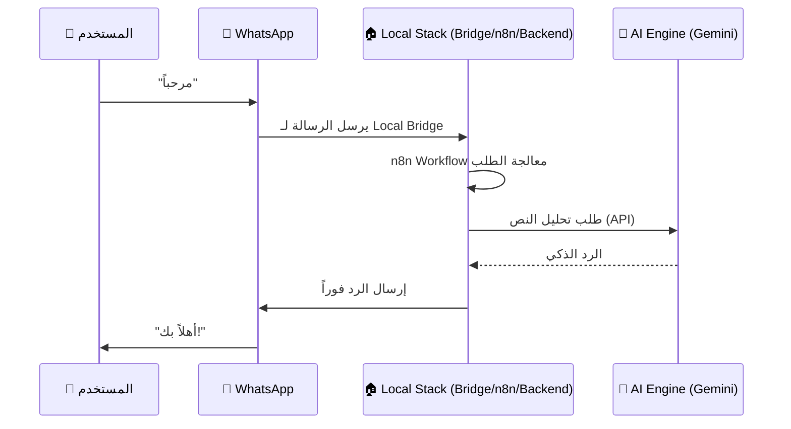

# 🏠 خريطة النظام المحلي (Local Stack Map)

تم تحديث النظام ليعمل بالكامل بنظام **Local Stack** لضمان السرعة المطلقة والخصوصية التامة، مع استبدال البنية التحتية السحابية (Local Server) ببيئة محلية قوية.

إليك التفصيل للمكونات الحالية:

---

## 1️⃣ البيئة المحلية (Local Infrastructure) 🏠

**الهدف:** تشغيل كافة الخدمات الحيوية على جهاز المستخدم أو السيرفر المحلي.

| الخدمة           | الاسم في Docker   | الوظيفة                | الحالة                     |
| :--------------- | :---------------- | :--------------------- | :------------------------- |
| **Local Bridge** | `baileys-service` | بوابة الواتساب المحلية | 🟢 Active (localhost:3000) |
| **G777 Backend** | `g777-backend`    | العقل والمحرك الرئيسي  | 🟢 Active (localhost:8080) |
| **PostgreSQL**   | `postgres`        | قاعدة البيانات المحلية | 🟢 Active                  |
| **Redis**        | `redis`           | الذاكرة المؤقتة        | 🟢 Active                  |
| **n8n Local**    | `n8n`             | محرك الأتمتة           | 🟢 Active (localhost:5678) |

---

## 2️⃣ الخدمات السحابية (Cloud Support) ☁️

**الهدف:** دعم قاعدة البيانات والذكاء الاصطناعي عبر خدمات مستقرة.

| الخدمة        | المنصة       | الوظيفة                           |
| :------------ | :----------- | :-------------------------------- |
| **SaaS DB**   | `Supabase`   | إدارة بيانات المستخدمين والتراخيص |
| **AI Engine** | `Gemini 2.0` | معالجة النصوص والوسائط المتعددة   |

---

## 🔄 مسار البيانات الجديد (Unified Local Flow)

---

## 💡 الخلاصة (Executive Summary)

1.  **الأداء 💪**: سرعة استجابة فائقة بفضل استخدام `localhost` بدلاً من المسارات السحابية الطويلة.
2.  **الأمان 🛡️**: بياناتك وجلساتك لا تغادر بيئتك المحلية.
3.  **التكلفة 💸**: تم إلغاء تكاليف Local Server بالكامل.

---

### 🛠️ ملفات التحكم:

- **لتشغيل النظام:** `docker-compose.yaml` (المعد للعمل محلياً)
- **للمزامنة:** الـ Webhook يشير الآن إلى `localhost` داخلياً.

---

**تم تحديث الذاكرة بنجاح 🕵️‍♂️**
